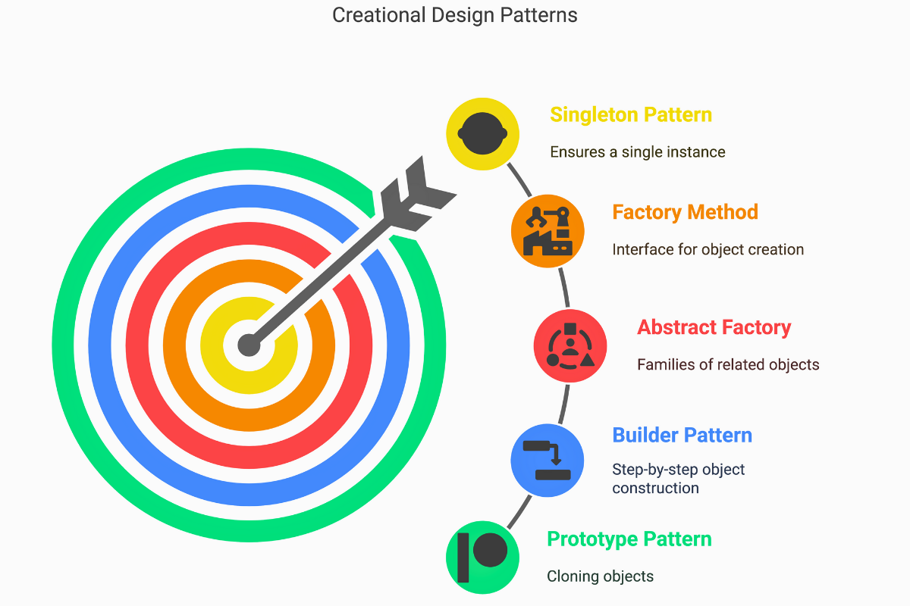

 
## Making the Estimate ##
 
When it came to estimating effort for tasks on Bow-lletins, I did not have a formal system. Most of my estimates came from gut feeling built up over the semester. If a task felt similar to something I had done before, I used that experience as a rough baseline. Setting up a new page with a form, for example, felt familiar enough that I could guess it would take a few hours. Something I had never done before, like configuring authentication or setting up a database schema, felt harder to pin down, so I gave myself more buffer.
 
I did not break tasks into subtasks and add up the parts, which in hindsight probably would have been more accurate. Instead, I looked at the task as a whole and made a call. That approach worked well enough for smaller, well-defined tasks, but it broke down for anything with unknowns.
 
## Did Estimating Help Even When It Was Wrong? ##
 
Surprisingly, yes. Even when my estimates were off, the act of estimating forced me to think through what a task actually involved before starting it. It is easy to look at an issue on the project board and assume it is simple until you sit down and think about what steps are actually required. Estimating made me do that thinking upfront.

 
There were tasks I underestimated, usually ones that involved debugging or integrating with something unfamiliar. There were also tasks I overestimated, typically ones I had done something similar to before and moved through faster than expected. The mix kept me from being consistently overconfident, which I think helped with planning.
 
One concrete benefit was that estimates gave the team a shared sense of priority. If something was expected to take a long time, we could flag it early and plan around it rather than discovering the problem midway through the sprint.
 
## Tracking Actual Effort ##
 
My tracking method was informal. I kept a rough mental note of how long things took rather than logging hours in a tool or spreadsheet. That meant my tracking was probably not very accurate in an objective sense. I could tell the difference between a task that took thirty minutes and one that took an entire afternoon, but I likely could not account for interruptions, context switching, or the time spent staring at a bug before identifying it.
 
Despite that imprecision, the mental notes were still useful. They gave me a general sense of where my time was going and helped me calibrate future estimates. If I spent much longer than expected on something, I would remember that next time a similar task came up.
 
## What I Would Change ##
 
The biggest thing I would change is moving from mental tracking to something more concrete, even just a simple notes file or a running log in the project board. It does not need to be elaborate. The problem with relying on memory is that it is hard to look back at the end of a project and draw any real conclusions. I had a general sense of how time was spent, but I could not point to specific numbers.
 
I would also try breaking estimates into smaller pieces more consistently. Estimating a task as a whole often hid complexity that only became obvious once I was already in the middle of it. Smaller subtasks would have made those hidden parts more visible upfront and led to more realistic estimates overall.
 
*Used ChatGPT to help with grammar and punctuation.*
 
