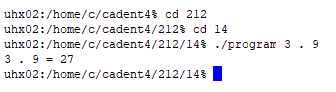

<div class="text-center p-4">
  
</div>

This is a C-based command-line calculator that I made in ICS 212 that performs basic arithmetic operations, like addition, subtraction, multiplication, and division. The program accepts three command-line arguments in this order: a digit, an operator, and another digit. Then it validates the input to make sure it has correct formatting and the supported operations before execution.

The program shows fundamental C programming concepts such as command-line argument processing, input validation, function prototypes, and the use of function pointers to dynamically select arithmetic operations. By organizing each operation into its own function and using structured error handling, this project highlights efficient program design and low level problem-solving skills in C.

**Code Sample:**


```cpp
#include <stdio.h>

int add(int, int);
int sub(int, int);
int mul(int, int);
int div2(int, int);

int main(int argc, char *argv[]) {
    if (argc != 4) {
        printf("Error: 4 command line arguments are expected, %i present.\n", argc);
        return 1;
    }

    if (argv[1][0] < '0' || argv[1][0] > '9') {
        printf("Error: '%c' is not an integer between 0 - 9.\n", argv[1][0]);
        return 1;
    }

    if (argv[3][0] < '0' || argv[3][0] > '9') {
        printf("Error: '%c' is not an integer between 0 - 9.\n", argv[3][0]);
        return 1;
    }

    char op = argv[2][0];
    if (op != '+' && op != '-' && op != '.' && op != '/') {
        printf("Error: '%c' is not a valid math operation. Use: + - . /\n", op);
        return 1;
    }

    int num1 = argv[1][0] - '0';
    int num2 = argv[3][0] - '0';

    int (*arithmeticOperations[5])(int, int) = {add, NULL, sub, mul, div2};

    int index = argv[2][0] - '+';

    int result = (*arithmeticOperations[index])(num1, num2);
    printf("%i %c %i = %i\n", num1, op, num2, result);

    return 0;
}

int add(int a, int b) {
    return a + b;
}

int sub(int a, int b) {
    return a - b;
}

int mul(int a, int b) {
    return a * b;
}

int div2(int a, int b) {
    return a / b;
}

// Example of command line argument: 3 . 2
```
