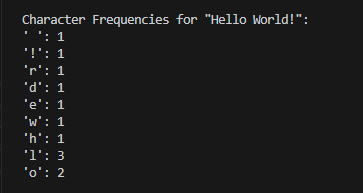

<div class="text-center p-4">
  
</div>

CharacterCounter is a Java console application I made in ICS 211 during summer of 2025. It analyzes a string and counts the frequency of each character, treating uppercase and lowercase letters as the same. Using a HashMap to efficiently track character occurrences, it demonstrates key programming concepts such as string manipulation, iteration, and the use of collections. The program outputs a frequency breakdown for any input text(as seen above). This makes it a simple yet effective tool for learning data structures and algorithmic thinking in Java.

This is the raw code, just change string "sampleText" to your own text:

```cpp
import java.util.HashMap;
import java.util.Map;

public class CharacterCounter {

    public static Map<Character, Integer> countCharacters(String text) {
        Map<Character, Integer> charCountMap = new HashMap<>();

        for (int i = 0; i < text.length(); i++) {
            char c = Character.toLowerCase(text.charAt(i));

            if (charCountMap.containsKey(c)) {
                int currentCount = charCountMap.get(c);
                charCountMap.put(c, currentCount + 1);
            } else {
                charCountMap.put(c, 1);
            }
        }

        return charCountMap;
    }

    public static void main(String[] args) {
        String sampleText = "Hello World!"; // CHANGE THIS
        Map<Character, Integer> characterCounts = countCharacters(sampleText);

        if (characterCounts != null) {
            System.out.println("Character Frequencies for \"" + sampleText + "\":");
            for (Map.Entry<Character, Integer> entry : characterCounts.entrySet()) {
                System.out.println("'" + entry.getKey() + "': " + entry.getValue());
            }
        } else {
            System.out.println("Error: The countCharacters method returned null.");
        }
    }
}
```
